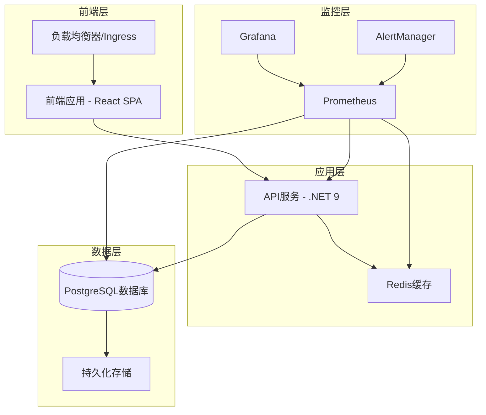

# Oil Trading System - Cloud Native Deployment Guide

## 🚀 完整的云原生部署解决方案

本指南提供了Oil Trading System的完整云原生部署解决方案，包括容器化、Kubernetes编排、CI/CD流水线、监控告警和生产级部署自动化。

## 📋 目录

- [架构概览](#架构概览)
- [前置要求](#前置要求)
- [快速开始](#快速开始)
- [详细部署步骤](#详细部署步骤)
- [监控与告警](#监控与告警)
- [安全配置](#安全配置)
- [故障排除](#故障排除)
- [生产运维](#生产运维)

## 🏗️ 架构概览

### 核心组件



### 技术栈

| 组件 | 技术 | 版本 | 用途 |
|------|------|------|------|
| 容器运行时 | Docker | 24.x | 应用容器化 |
| 编排平台 | Kubernetes | 1.25+ | 容器编排 |
| 包管理 | Helm | 3.12+ | 模板化部署 |
| CI/CD | GitHub Actions | - | 自动化流水线 |
| 监控 | Prometheus + Grafana | Latest | 监控告警 |
| 密钥管理 | External Secrets Operator | 0.9+ | 密钥管理 |
| 服务网格 | Istio (可选) | 1.19+ | 服务治理 |

## 📦 前置要求

### 环境要求

1. **Kubernetes集群**
   - 版本: 1.25+
   - 节点数量: 最少3个节点
   - 资源: 每节点最少8GB内存, 4核CPU
   - 存储: 支持动态存储卷

2. **工具安装**
   ```bash
   # 必需工具
   kubectl >= 1.25
   helm >= 3.12
   docker >= 24.0
   
   # 可选工具
   k9s          # Kubernetes UI
   kubectx      # 上下文切换
   stern        # 日志聚合
   ```

3. **访问权限**
   - Kubernetes集群管理员权限
   - 容器镜像仓库推送权限
   - DNS配置权限（生产环境）

### 存储要求

| 组件 | 存储类型 | 大小 | IOPS要求 |
|------|----------|------|----------|
| PostgreSQL | SSD | 50GB+ | 3000+ |
| Redis | SSD | 10GB | 1000+ |
| Prometheus | SSD | 50GB | 1000+ |
| Grafana | SSD | 10GB | 500+ |
| 日志存储 | SSD | 100GB+ | 1000+ |

## 🚀 快速开始

### 1. 克隆代码库

```bash
git clone https://github.com/your-org/oil-trading-system.git
cd oil-trading-system
```

### 2. 配置环境

```bash
# 复制环境配置文件
cp helm/oil-trading-system/values-staging.yaml.example \
   helm/oil-trading-system/values-staging.yaml

# 编辑配置文件
vim helm/oil-trading-system/values-staging.yaml
```

### 3. 部署到Staging环境

```bash
# 使用部署脚本
./scripts/deploy-complete-system.sh --environment staging

# 或使用PowerShell (Windows)
.\scripts\deploy-complete-system.ps1 -Environment staging
```

### 4. 验证部署

```bash
# 检查pod状态
kubectl get pods -n oil-trading-staging

# 检查服务状态
kubectl get services -n oil-trading-staging

# 运行健康检查
./scripts/health-check-and-recovery.sh check --environment staging
```

## 📋 详细部署步骤

### 阶段一：容器镜像构建

#### 1. 构建优化的Docker镜像

```bash
# API服务镜像
docker build -f Dockerfile.production -t oil-trading-api:v1.0.0 .

# 前端应用镜像
docker build -f frontend/Dockerfile -t oil-trading-frontend:v1.0.0 ./frontend
```

#### 2. 安全扫描

```bash
# 漏洞扫描
trivy image oil-trading-api:v1.0.0
trivy image oil-trading-frontend:v1.0.0

# 镜像签名
cosign sign oil-trading-api:v1.0.0
```

#### 3. 推送到镜像仓库

```bash
# 标记镜像
docker tag oil-trading-api:v1.0.0 ghcr.io/your-org/oil-trading-api:v1.0.0

# 推送镜像
docker push ghcr.io/your-org/oil-trading-api:v1.0.0
```

### 阶段二：Kubernetes基础设施

#### 1. 创建命名空间

```bash
kubectl apply -f - <<EOF
apiVersion: v1
kind: Namespace
metadata:
  name: oil-trading-production
  labels:
    name: oil-trading-production
    environment: production
EOF
```

#### 2. 配置RBAC

```bash
kubectl apply -f k8s/base/rbac.yaml
```

#### 3. 部署External Secrets Operator

```bash
# 安装Operator
helm repo add external-secrets https://charts.external-secrets.io
helm install external-secrets external-secrets/external-secrets -n external-secrets-system --create-namespace

# 配置SecretStore
kubectl apply -f k8s/external-secrets/
```

### 阶段三：存储和数据库

#### 1. 部署PostgreSQL

```bash
# 使用Bitnami Helm Chart
helm repo add bitnami https://charts.bitnami.com/bitnami

helm install postgresql bitnami/postgresql \
  --namespace oil-trading-production \
  --set auth.database=OilTradingDb \
  --set auth.username=oiltrading \
  --set primary.persistence.size=50Gi \
  --set primary.persistence.storageClass=fast-ssd
```

#### 2. 部署Redis

```bash
helm install redis bitnami/redis \
  --namespace oil-trading-production \
  --set master.persistence.size=10Gi \
  --set master.persistence.storageClass=fast-ssd
```

### 阶段四：应用部署

#### 1. 使用Helm部署应用

```bash
# 生产环境部署
helm install oil-trading-production helm/oil-trading-system \
  --namespace oil-trading-production \
  --create-namespace \
  -f helm/oil-trading-system/values-production.yaml \
  --set image.tag=v1.0.0 \
  --wait --timeout=10m
```

#### 2. 配置Ingress

```bash
# 安装nginx-ingress
helm repo add ingress-nginx https://kubernetes.github.io/ingress-nginx
helm install ingress-nginx ingress-nginx/ingress-nginx

# 应用SSL证书
kubectl apply -f k8s/base/ingress.yaml
```

### 阶段五：监控和告警

#### 1. 部署Prometheus Stack

```bash
# 安装kube-prometheus-stack
helm repo add prometheus-community https://prometheus-community.github.io/helm-charts
helm install monitoring prometheus-community/kube-prometheus-stack \
  --namespace monitoring \
  --create-namespace \
  -f k8s/monitoring/prometheus-values.yaml
```

#### 2. 配置Grafana仪表板

```bash
kubectl apply -f k8s/monitoring/grafana-dashboards.yaml
```

#### 3. 设置告警规则

```bash
kubectl apply -f k8s/monitoring/prometheus-operator.yaml
```

## 📊 监控与告警

### Prometheus指标

系统自动收集以下关键指标：

| 指标类型 | 指标名称 | 说明 |
|----------|----------|------|
| 应用指标 | `http_requests_total` | HTTP请求总数 |
| 应用指标 | `http_request_duration_seconds` | 请求响应时间 |
| 业务指标 | `oil_trading_active_contracts_total` | 活跃合同数量 |
| 业务指标 | `oil_trading_portfolio_value_usd` | 投资组合价值 |
| 业务指标 | `oil_trading_var_95_percent` | 95% VaR值 |
| 系统指标 | `container_memory_usage_bytes` | 内存使用量 |
| 系统指标 | `container_cpu_usage_seconds_total` | CPU使用时间 |

### 告警规则

系统配置了以下关键告警：

1. **高错误率告警**
   ```yaml
   - alert: HighErrorRate
     expr: rate(http_requests_total{code=~"5.."}[5m]) / rate(http_requests_total[5m]) > 0.05
     for: 2m
     labels:
       severity: critical
   ```

2. **高响应时间告警**
   ```yaml
   - alert: HighResponseTime
     expr: histogram_quantile(0.95, rate(http_request_duration_seconds_bucket[5m])) > 1
     for: 5m
     labels:
       severity: warning
   ```

3. **资源使用告警**
   ```yaml
   - alert: HighMemoryUsage
     expr: container_memory_usage_bytes / container_spec_memory_limit_bytes > 0.85
     for: 10m
     labels:
       severity: warning
   ```

### Grafana仪表板

系统提供以下预配置仪表板：

1. **系统概览仪表板**
   - 服务健康状态
   - 请求率和响应时间
   - 错误率趋势
   - 资源使用情况

2. **基础设施仪表板**
   - CPU和内存使用
   - 网络I/O
   - 磁盘I/O
   - Pod状态

3. **业务指标仪表板**
   - 合同数量统计
   - 交易量趋势
   - 风险指标
   - 价格变动

4. **数据库仪表板**
   - 连接数
   - 查询性能
   - 缓存命中率
   - 磁盘使用

## 🔒 安全配置

### 密钥管理

#### 1. External Secrets配置

```yaml
apiVersion: external-secrets.io/v1beta1
kind: ExternalSecret
metadata:
  name: oil-trading-secrets
spec:
  refreshInterval: 1h
  secretStoreRef:
    name: vault-backend
    kind: SecretStore
  target:
    name: oil-trading-secrets
  data:
  - secretKey: database-password
    remoteRef:
      key: oil-trading/database
      property: password
```

#### 2. 密钥轮换

系统自动轮换以下密钥：
- 数据库密码：每月1号
- JWT密钥：每月15号  
- TLS证书：每周检查，30天内过期时自动更新

### 网络安全

#### 1. 网络策略

```yaml
apiVersion: networking.k8s.io/v1
kind: NetworkPolicy
metadata:
  name: oil-trading-network-policy
spec:
  podSelector:
    matchLabels:
      app: oil-trading-system
  policyTypes:
  - Ingress
  - Egress
  ingress:
  - from:
    - namespaceSelector:
        matchLabels:
          name: ingress-nginx
  egress:
  - to:
    - namespaceSelector:
        matchLabels:
          name: monitoring
```

#### 2. Pod安全策略

```yaml
apiVersion: policy/v1beta1
kind: PodSecurityPolicy
metadata:
  name: oil-trading-psp
spec:
  privileged: false
  allowPrivilegeEscalation: false
  requiredDropCapabilities:
    - ALL
  runAsUser:
    rule: 'MustRunAsNonRoot'
  readOnlyRootFilesystem: true
```

### 镜像安全

1. **镜像扫描**：所有镜像在部署前进行漏洞扫描
2. **镜像签名**：使用Cosign对镜像进行签名验证
3. **基础镜像**：使用最小化的Alpine Linux基础镜像
4. **非root用户**：容器以非root用户运行

## 🛠️ 故障排除

### 常见问题

#### 1. Pod启动失败

```bash
# 查看Pod状态
kubectl get pods -n oil-trading-production

# 查看Pod事件
kubectl describe pod <pod-name> -n oil-trading-production

# 查看Pod日志
kubectl logs <pod-name> -n oil-trading-production
```

#### 2. 服务无法访问

```bash
# 检查服务端点
kubectl get endpoints -n oil-trading-production

# 检查Ingress状态
kubectl get ingress -n oil-trading-production

# 测试服务连通性
kubectl run test-pod --image=curlimages/curl:latest --rm -i --restart=Never -- curl http://service-name
```

#### 3. 数据库连接问题

```bash
# 检查数据库Pod状态
kubectl get pods -l app.kubernetes.io/component=database -n oil-trading-production

# 测试数据库连接
kubectl exec -it <postgres-pod> -n oil-trading-production -- psql -U postgres -d OilTradingDb -c "SELECT 1;"

# 查看数据库日志
kubectl logs <postgres-pod> -n oil-trading-production
```

### 性能调优

#### 1. 资源优化

```yaml
# 生产环境资源配置
resources:
  requests:
    memory: "512Mi"
    cpu: "250m"
  limits:
    memory: "2Gi"
    cpu: "1000m"
```

#### 2. 水平扩展

```bash
# 手动扩展
kubectl scale deployment oil-trading-api --replicas=5 -n oil-trading-production

# 自动扩展配置
kubectl apply -f k8s/base/hpa.yaml
```

#### 3. 数据库优化

```sql
-- 查看慢查询
SELECT query, mean_time, calls 
FROM pg_stat_statements 
ORDER BY mean_time DESC 
LIMIT 10;

-- 分析表统计信息
ANALYZE;

-- 重建索引
REINDEX DATABASE OilTradingDb;
```

## 🚀 生产运维

### 部署策略

#### 1. 蓝绿部署

```bash
# 部署到蓝环境
helm install oil-trading-blue helm/oil-trading-system \
  --namespace oil-trading-blue \
  -f values-production.yaml \
  --set ingress.enabled=false

# 测试蓝环境
./scripts/health-check-and-recovery.sh check --namespace oil-trading-blue

# 切换流量
kubectl patch ingress oil-trading-ingress -p '{"spec":{"rules":[{"host":"oiltrading.example.com","http":{"paths":[{"path":"/","pathType":"Prefix","backend":{"service":{"name":"oil-trading-blue-api","port":{"number":8080}}}}]}}]}}'
```

#### 2. 金丝雀部署

```yaml
# Argo Rollouts配置
apiVersion: argoproj.io/v1alpha1
kind: Rollout
metadata:
  name: oil-trading-api
spec:
  strategy:
    canary:
      steps:
      - setWeight: 10
      - pause: {duration: 5m}
      - setWeight: 50
      - pause: {duration: 10m}
      - setWeight: 100
```

### 备份策略

#### 1. 数据库备份

```bash
# 创建备份任务
kubectl create job postgres-backup-$(date +%Y%m%d) \
  --from=cronjob/postgres-backup \
  -n oil-trading-production

# 验证备份
kubectl logs job/postgres-backup-$(date +%Y%m%d) -n oil-trading-production
```

#### 2. 配置备份

```bash
# 备份Kubernetes配置
kubectl get all -n oil-trading-production -o yaml > backup-$(date +%Y%m%d).yaml

# 备份Helm配置
helm get values oil-trading-production -n oil-trading-production > values-backup-$(date +%Y%m%d).yaml
```

### 灾难恢复

#### 1. 数据恢复

```bash
# 从备份恢复数据库
kubectl exec -i <postgres-pod> -n oil-trading-production -- psql -U postgres -d OilTradingDb < backup.sql
```

#### 2. 完整系统恢复

```bash
# 重新部署系统
helm install oil-trading-production helm/oil-trading-system \
  --namespace oil-trading-production \
  -f values-backup.yaml

# 恢复数据
kubectl apply -f backup-$(date +%Y%m%d).yaml
```

### 维护操作

#### 1. 计划维护

```bash
# 1. 通知用户维护窗口
# 2. 创建数据库备份
./scripts/backup-database.sh

# 3. 排空节点
kubectl drain <node-name> --ignore-daemonsets --delete-emptydir-data

# 4. 执行维护操作
# 5. 恢复节点
kubectl uncordon <node-name>

# 6. 验证系统健康
./scripts/health-check-and-recovery.sh check
```

#### 2. 滚动更新

```bash
# 更新应用镜像
helm upgrade oil-trading-production helm/oil-trading-system \
  --set image.tag=v1.1.0 \
  --wait --timeout=10m

# 监控更新进度
kubectl rollout status deployment/oil-trading-api -n oil-trading-production
```

### 监控维护

#### 1. 监控数据清理

```bash
# 清理Prometheus历史数据
kubectl exec -it prometheus-pod -n monitoring -- promtool tsdb delete --time="2023-01-01T00:00:00Z"

# 清理Grafana旧仪表板
kubectl delete configmap old-dashboards -n monitoring
```

#### 2. 日志轮转

```bash
# 配置日志轮转
kubectl apply -f - <<EOF
apiVersion: v1
kind: ConfigMap
metadata:
  name: logrotate-config
data:
  logrotate.conf: |
    /var/log/oil-trading/*.log {
        daily
        rotate 30
        compress
        delaycompress
        missingok
        notifempty
        create 644 oil-trading oil-trading
    }
EOF
```

## 📚 参考资源

### 官方文档

- [Kubernetes官方文档](https://kubernetes.io/docs/)
- [Helm官方文档](https://helm.sh/docs/)
- [Prometheus官方文档](https://prometheus.io/docs/)
- [Docker官方文档](https://docs.docker.com/)

### 最佳实践

- [Kubernetes生产最佳实践](https://kubernetes.io/docs/setup/best-practices/)
- [容器安全最佳实践](https://kubernetes.io/docs/concepts/security/)
- [Helm最佳实践](https://helm.sh/docs/chart_best_practices/)

### 社区资源

- [CNCF Landscape](https://landscape.cncf.io/)
- [Kubernetes社区](https://kubernetes.io/community/)
- [Cloud Native Computing Foundation](https://www.cncf.io/)

## 🆘 支持

如需帮助，请联系：

- **技术支持**: devops@oiltrading.example.com
- **文档更新**: docs@oiltrading.example.com
- **安全问题**: security@oiltrading.example.com

---

**注意**: 本文档持续更新，请定期查看最新版本。

版本: 1.0.0  
更新日期: 2025-01-17  
维护团队: Oil Trading System DevOps Team